# VSD PLL using sky130nm OpenPDK Workshop
A 2-day workshop in the analysis and implementation of PLL in skywater 130nm OpenPDK is conducted by VSD. <br/> 
The report presents the activities done during the two-day workshop. 

Table of contents
=================
<!--ts-->
   * [Day 1](https://github.com/manjunathrv/VSD_PLL_using_sky130nm_PDK#day-1)
      * [Introduction to Phase Locked Loop(PLL)](https://github.com/manjunathrv/VSD_PLL_using_sky130nm_PDK#introduction-to-phase-locked-looppll)
      * [Phase Locked Loop(PLL) Specification](https://github.com/manjunathrv/VSD_PLL_using_sky130nm_PDK#phase-locked-looppll-specification)
      * [Tool Setup](https://github.com/manjunathrv/VSD_PLL_using_sky130nm_PDK#tool-setup)
   * [Day 2](https://github.com/manjunathrv/VSD_PLL_using_sky130nm_PDK#day-2)
      * [Frequency Divider circuit](https://github.com/manjunathrv/VSD_PLL_using_sky130nm_PDK#frequency-divider-circuit)
      * [Charge pump circuit](https://github.com/manjunathrv/VSD_PLL_using_sky130nm_PDK#charge-pump-circuit)
      * [Voltage control oscillator circuit](https://github.com/manjunathrv/VSD_PLL_using_sky130nm_PDK#voltage-control-oscillator-circuit)
      * [Phase frequency detector](https://github.com/manjunathrv/VSD_PLL_using_sky130nm_PDK#phase-frequency-detector-circuit)
      * [PLL circuit simulation](https://github.com/manjunathrv/VSD_PLL_using_sky130nm_PDK#pll-circuit-simulation)
      * [Post layout analysis of the Phase frequency detector](https://github.com/manjunathrv/VSD_PLL_using_sky130nm_PDK#post-layout-analysis-of-the-phase-frequency-detector)
      * [Combine the layout of the circuit components](https://github.com/manjunathrv/VSD_PLL_using_sky130nm_PDK#combine-pll-layout-with-caravel-soc)
   * [Reference](https://github.com/manjunathrv/VSD_PLL_using_sky130nm_PDK#reference)
   * [Acknowledgement](https://github.com/manjunathrv/VSD_PLL_using_sky130nm_PDK#acknowledgement) 

# Day 1 

## Introduction to Phase Locked Loop(PLL)
A Phase Locked Loop generates a precise clock signal, <br/>
The components of the PLL are described in the block diagram below, <br/> 

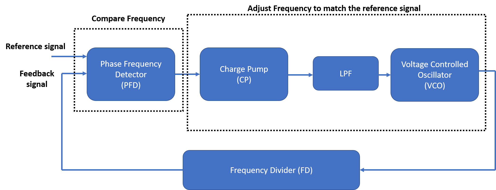 <br/> 

| Components                     | Funtionality           |
|--------------------------------|-----------------------|
| Phase Frequency Detector (PFD) | Comparison between the phase difference between Feedback signal and Reference signal |
| Charge Pump (CP) | Converts the digital output of the PFD to analog signal |
| Low Pass Filter(LP) | Smoothen the charge pump output signal  |
| Voltage Control Oscillator (VCO) | Onchip ring oscillator controlled by Voltage  |
| Frequency Divider (FD) | Output frequencies that is multiple of the reference clock signal  |

The circuit implementation, simulation and layout of the components of the PLL will be discussed in Day 2.<br/>

## Phase Locked Loop(PLL) Specification 
The PLL specification are described below, 

| Specification                     | Value           |
|--------------------------------|-----------------------|
| Corner | TT (Typical) |
| Supply Voltage | 1.8V  |
| Temperature | 25 DegC (Room Temperature) |
| Modes | VCO Mode and PLL mode |
| Input Frequency | Fmin = 5Mhz and Fmax = 12.5Mhz  |
| Mutiplier| Form factor and size of the battery  |
| Jitter (RMS) | <~20ns  |
| Duty Cycle | 50%  |

## Tool Setup
The tools and the setup details used for the development of the PLL are given below, 
| Tool                     | Description           | Setup details | 
|-----------------|---------------|-----------------------|
| Ngspice | Circuit Simulation | sudo apt-get install ngspice | 
| Magic | Layout Design  | Setup described in https://opencircuitdesign.com/magic |


# Day 2 

The implementation of the individual components of the PLL are described in this section. 

## Frequency divider circuit
The frequency divider consists of a toggle flip flop. <br/>
The output of the toggle flip flop will be half of input frequency signal. <br/>
The circuit diagram of the toggle flip flop is shown below, <br/> 
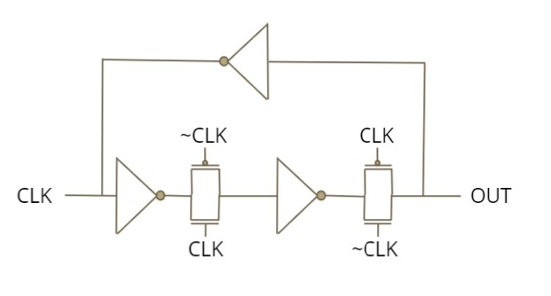 <br/> 

The spice file for the simulation of the Frequency divider is written as below, <br/>
```SystemVerilog
.include sky130nm.lib

xm1 1 2 3 1 sky130_fd_pr__pfet_01v8 l=150n w=720n 
xm2 0 2 3 0 sky130_fd_pr__nfet_01v8 l=150n w=360n 

xm3 3 Clkb 4 1 sky130_fd_pr__pfet_01v8 l=150n w=420n 
xm4 3 Clk 4 0 sky130_fd_pr__nfet_01v8 l=150n w=840n 

xm7 1 4 5 1 sky130_fd_pr__pfet_01v8 l=150n w=720n 
xm8 0 4 5 0 sky130_fd_pr__nfet_01v8 l=150n w=360n 

xm9 5 Clk 6 1 sky130_fd_pr__pfet_01v8 l=150n w=420n 
xm10 5 Clkb 6 0 sky130_fd_pr__nfet_01v8 l=150n w=640n 

xm11 1 6 2 1 sky130_fd_pr__pfet_01v8 l=150n w=720n 
xm12 0 6 2 0 sky130_fd_pr__nfet_01v8 l=150n w=360n 

xm13 1 Clk Clkb 1 sky130_fd_pr__pfet_01v8 l=150n w=720n 
xm14 0 Clk Clkb 0 sky130_fd_pr__nfet_01v8 l=150n w=360n 

v1 1 0 1.8
v2 Clk 0 PULSE 0 1.8 1n 6p 6p 5ns 10ns

c1 6 0 10f
.control
tran 0.1ns 0.2us
plot v(6) v(Clk)+2
.endc
.end
```
The command to run the spice file <br/>
```console
ngspice FD.cir
```
The output of the frequency divider is shown below,<br/>
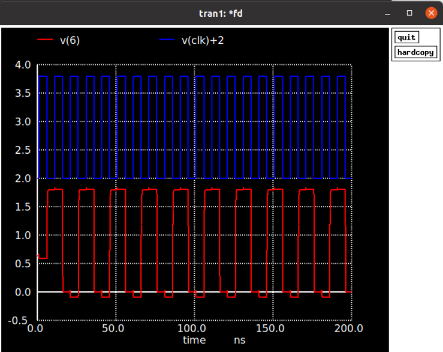 <br/> 

From the above result, it can be seen that the output frequency in red is half the input frequency in blue.<br/> 

The layout of the Frequency Divider is done using magic.<br/> 
The developed freqeuncy divider circuit can be opened using magic using the following commands, <br/>

```console
magic -T sky130A.tech FD.mag
```
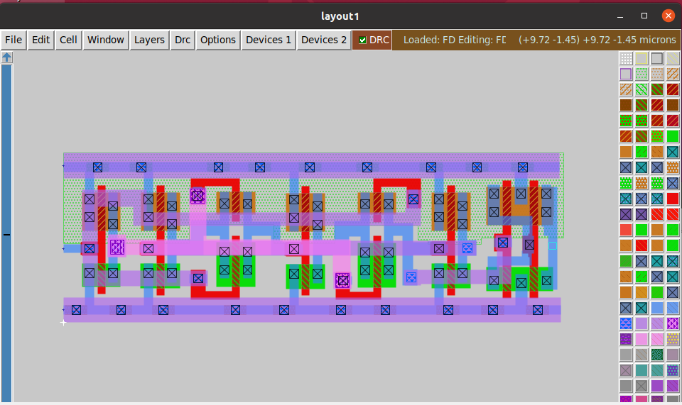 <br/> 

## Charge pump circuit
The charge pump circuit converts the digital output from the Phase frequency detector to analog output to control the voltage controlled oscillator. <br/>
The citcuit implementation consists of a current steering circuit implemented using mosfets as shown in the circuit below. <br/>
The mosfet transistor pair at the top and bottom of the circuit form the current sources in the design. <br/> 
During the time when UP is active the output voltage increases.The output voltage decreases during the  time when DOWN signal is active. <br/> 

 <br/> 

The obtained results using circuit simulation in ngspice is shown below, <br/>
<br/> 
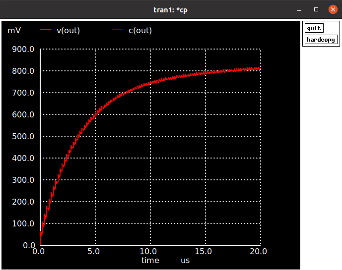 <br/>
From the output graphs, it is seen that the charge pump output signal increases with UP signal active. <br/>

The layout of the charge pump circuit is shown below,<br/> 
<br/>
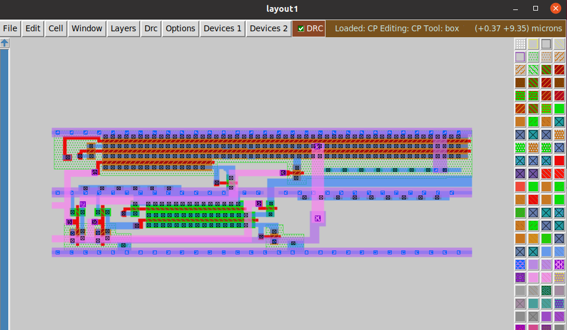 <br/>

## Voltage control oscillator circuit
The voltage control oscillator consists of a Ring oscillator having a series odd number of inverters. <br/> 
In the below circuit, the ring oscillator are implement with 3 inverter - 1st inverter: M3, M6 , 2nd inverter: M4, M7 and 3rd inverter: M5,M8 <br/> 
By using a current starving mechanism, the current through the ring oscillator can be controlled to obtain different output frequency. <br/> 
The input control voltage Vcntrl controls the current through the ring oscillator.  <br/> 
This results in the change in the frequency of the ring oscillator.  <br/> 
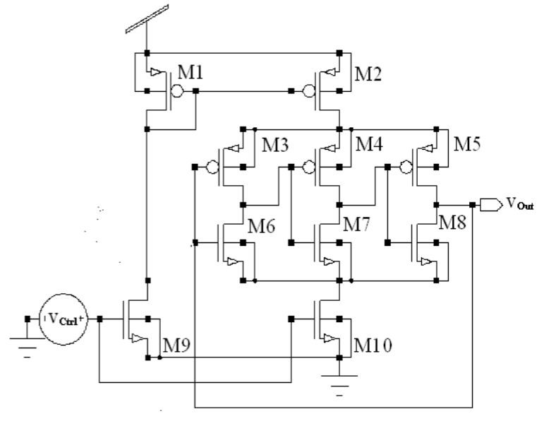 <br/> 

The circuit is simulated in ngspice. <br/> 
<br/> 
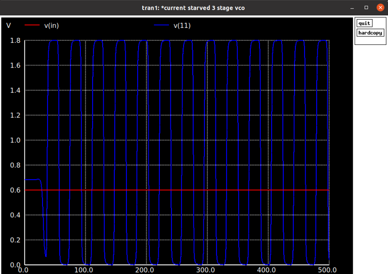 <br/> 
The results show that the oscillation have a voltage output with full swing from 0 to 1.8V. 

The layout of the charge pump circuit is shown below,<br/>
<br/>
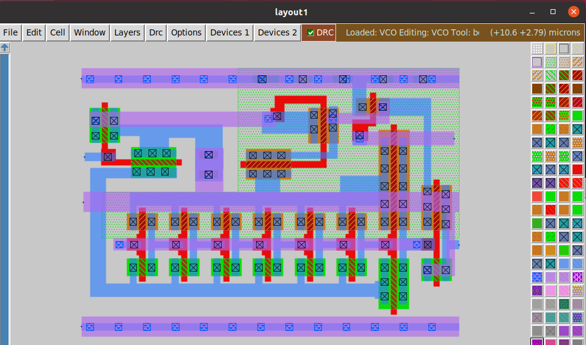 <br/> 

## Phase frequency detector circuit 
The Phase frequency detector generates output as UP signal if the VCO signal is laging the reference signal and a DOWN signal if the the output of the VCO is leading the reference signal. <br/>
The UP and DOWN signal determines if the output frequency of the VCO needs to be increased or decreased. <br/>
The Phase frequency detector is implement using the below circuit, <br/>
 <br/> 

The circuit is simulated in ngspice. The phase difference of the reference and the feedback signal is 6ns <br/> 
<br/> 
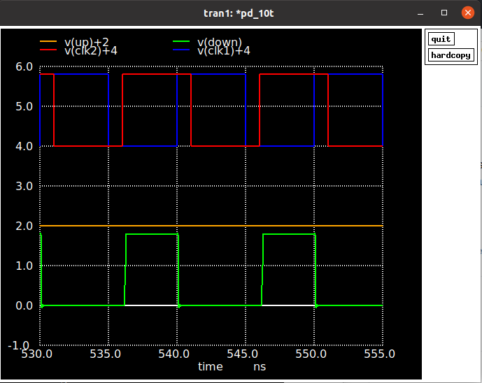 <br/>

The circuit is able to detect the small difference between the reference and feedback signal. <br/>

The layout of the Phase frequency detector in magic is shown below, <br/>
<br/>
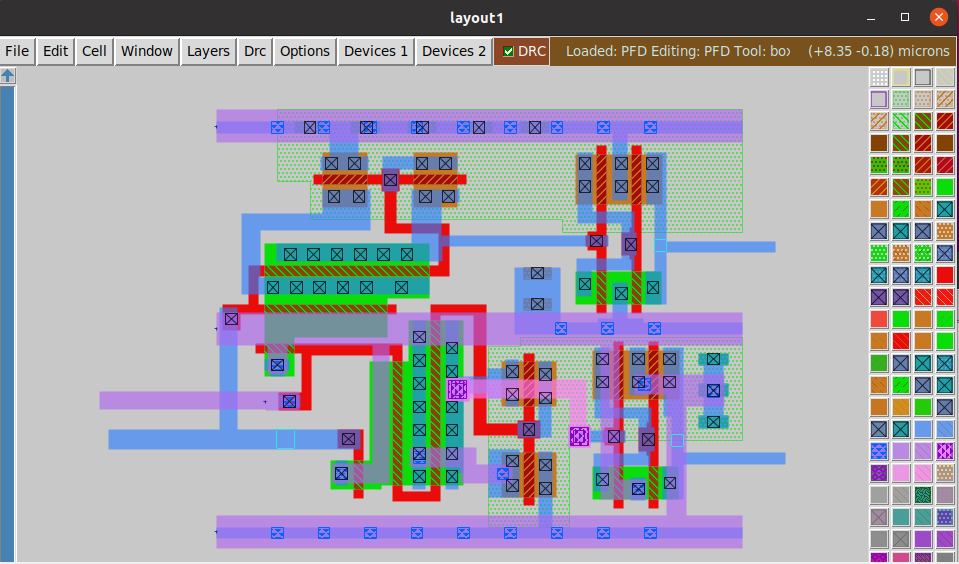 <br/>

## PLL circuit simulation  
In the next step, a combined simulation of all the circuit components are done in ngspice. <br/>
The obtained output from ngspice is shown below, <br/> 
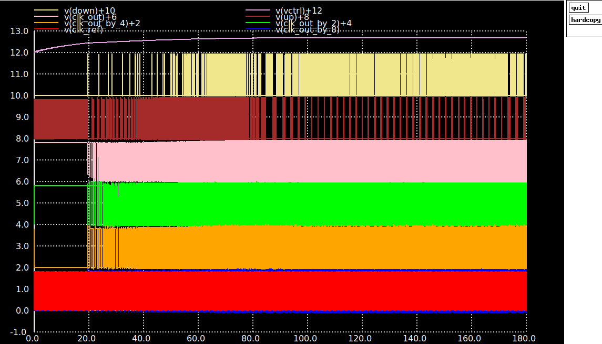 <br/>
<br/>
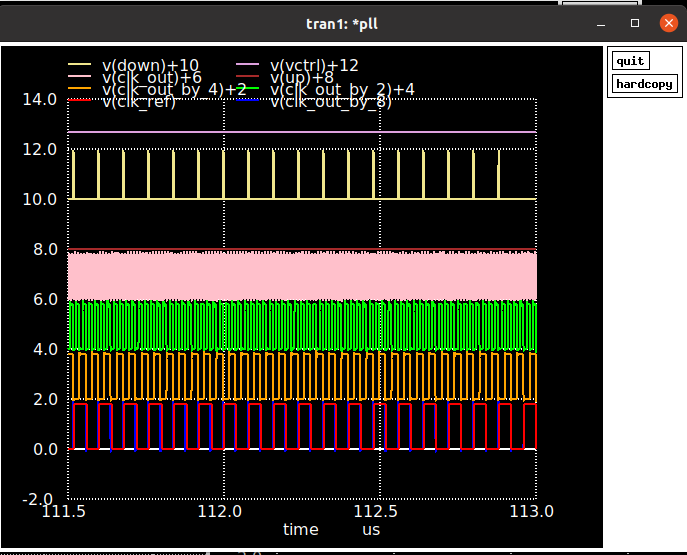 <br/>
<br/>
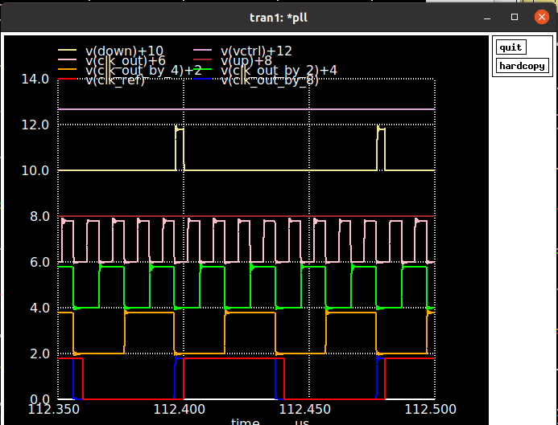 <br/>
<br/>
The frequency division is shown in signal with pink(4th row), green(5th row) and orange(6th row). <br/>
The reference signal is in red and the feedback signal is in blue show slight fluctuation.<br/>

The layout of the complete PLL in magic is shown below, <br/>
<br/>
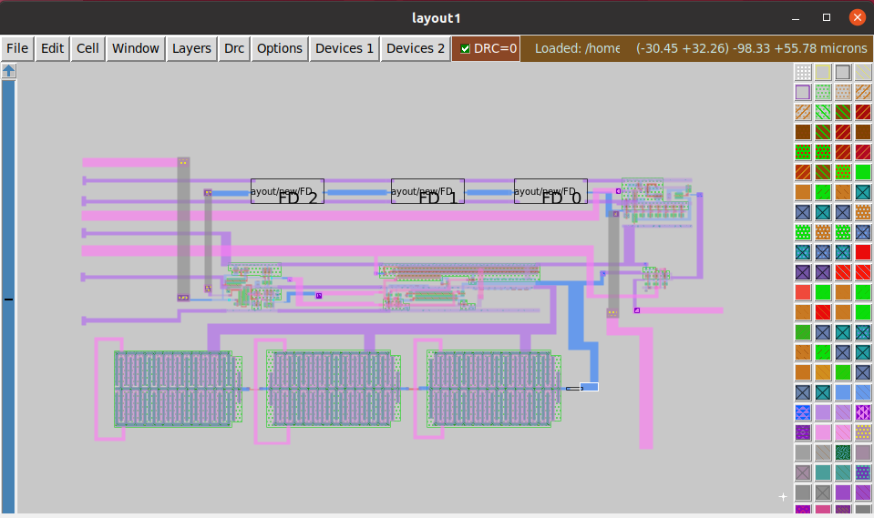 <br/>

## Post layout analysis of the Phase frequency detector  
The parasitic capacitance and resistance are extracted from the layout and post layout spice analysis is done. <br/>
The commands are executed in magic command window as shown below, <br/>
<br/>
 <br/>

The obtained output from ngspice for the post layout simulation is shown below, <br/> 
<br/>
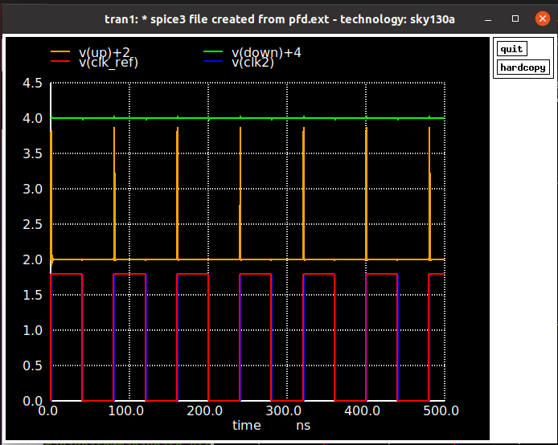 <br/>
The result shows that the circuit can detect phase difference of 1ns. 

## Combine the layout of the circuit components 
The layout of the charge pump circuit and the Voltage control oscillator using metal1 can be done in magic. <br/>
The combined layout of the charge pump circuit and the VCO is shown below, <br/>
 <br/>
 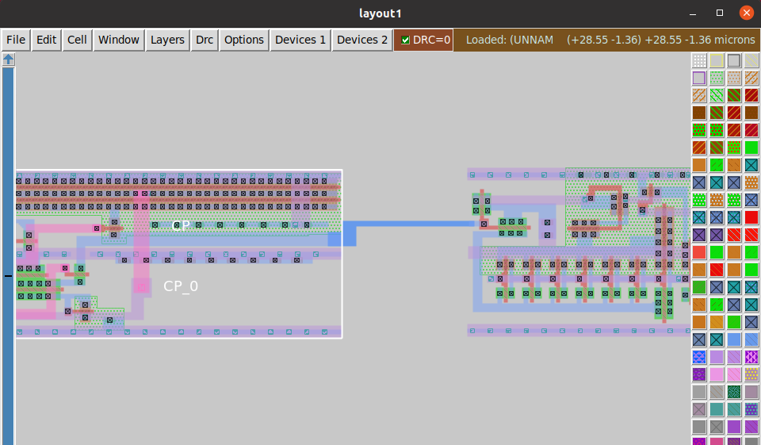 <br/>
 
 ## Combine PLL layout with Caravel SoC 
 The Caravel SoC is a PicoRV32 RISC based SoC provided by Google-Skywater OpenPDK programme. <br/>
 The user project area is about 2.92mm x 3.52mm with 36 GPIOs as shown in the block diagram below,<br/>
 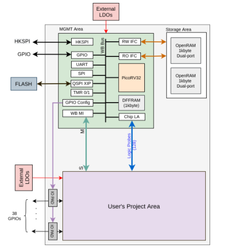 <br/>
 
 In the next step, the PLL layout is added in the user project area. <br/>
 The user_analog_project_wrapper_empty.gds file is downloaded from the efabless github https://github.com/efabless/caravel-lite/tree/main/gds <br/>
 The Pins are located on the corner of the block. In the below image the I/O pins can be found on the bottom left corner. <br/>
 <br/>
 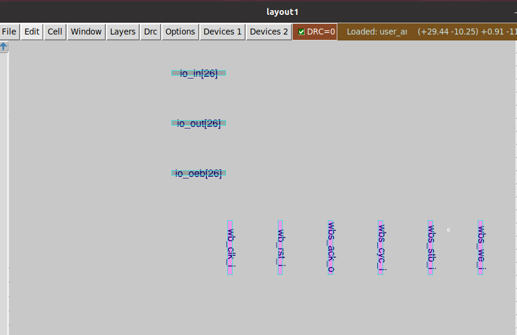 <br/>
 
 The PLL layout is placed as an instance on the upper left corner close to the analog IO pin. <br/>
 A metal 2 and metal 3 contact is done between the output pin of the PLL block and the analog IO pin. <br/>
 <br/>
 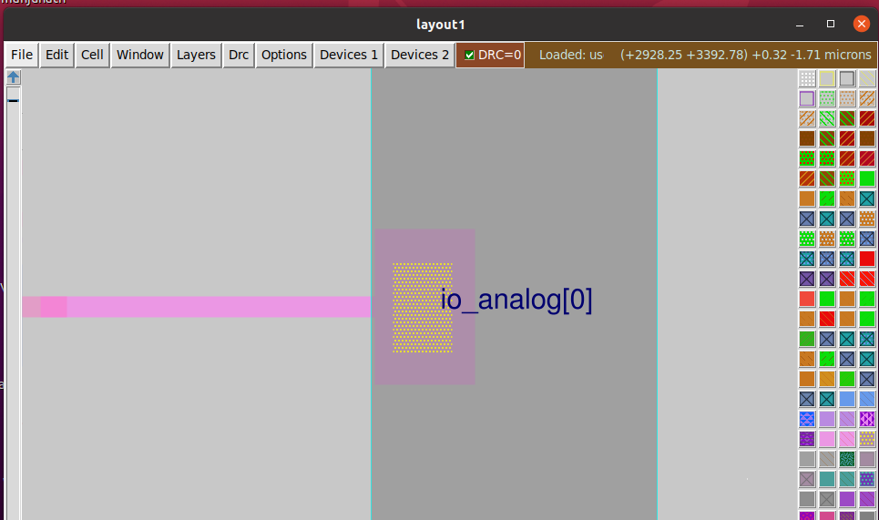 <br/>
 
 The final layout of PLL integrated with the caravel SOC is shown below, <br/>
 <br/>
 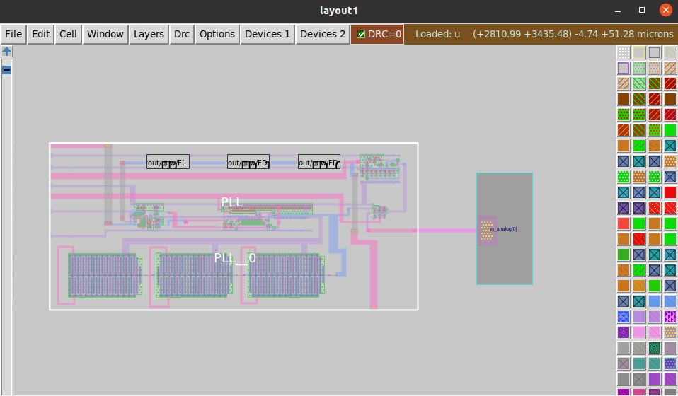 <br/>
 
 
# Reference 
Github of the PLL used in this workshop - https://github.com/lakshmi-sathi/avsdpll_1v8

# Acknowledgement 
Lakshmi Sathi - Course Instructor <br/>
Kunal Ghosh - VSD India Pvt Ltd <br/>


