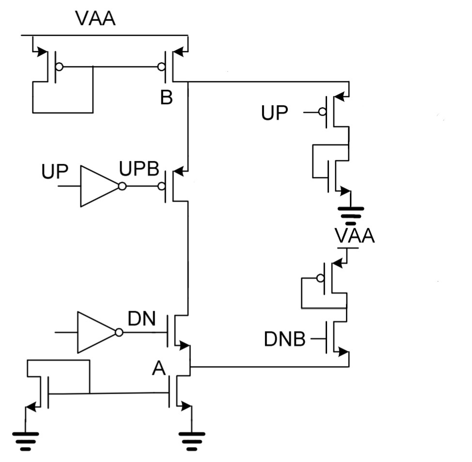
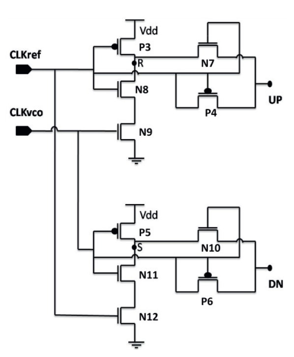

# VSD_PLL_using_sky130nm_PDK
A 2-day workshop in the analysis and implementation of PLL in skywater 130nm OpenPDK is conducted by VSD.   
The report presents the activities done during the two-day workshop. 

Table of contents
=================
<!--ts-->
   * [Day 1](https://github.com/manjunathrv/VSD_PLL_using_sky130nm_PDK#day-1)
      * [Introduction to Phase Locked Loop(PLL)](https://github.com/manjunathrv/VSD_PLL_using_sky130nm_PDK#introduction-to-physical-design-flow)
      * [Phase Locked Loop(PLL) Specification](https://github.com/manjunathrv/VSD_PLL_using_sky130nm_PDK#introduction-to-openlane-flow)
      * [Tool Setup](https://github.com/manjunathrv/VSD_PLL_using_sky130nm_PDK#openlane-directory-structure)
   * [Day 2](https://github.com/manjunathrv/VSD_PLL_using_sky130nm_PDK#day-2)
      * [Frequency Divider circuit](https://github.com/manjunathrv/VSD_Advanced_Physical_Design_with_sky130nmPDK#design-prepartion-and-synthesis-flow)
      * [Charge pump circuit](https://github.com/manjunathrv/VSD_Advanced_Physical_Design_with_sky130nmPDK#design-prepartion-and-synthesis-flow)
      * [Voltage control oscillator circuit](https://github.com/manjunathrv/VSD_Advanced_Physical_Design_with_sky130nmPDK#design-prepartion-and-synthesis-flow)
      * [Phase frequency detector](https://github.com/manjunathrv/VSD_Advanced_Physical_Design_with_sky130nmPDK#design-prepartion-and-synthesis-flow)

# Day 1 

## Introduction to Phase Locked Loop(PLL)
A Phase Locked Loop generates a precise clock signal,  
The components of the PLL are described in the block diagram below,   

   

| Components                     | Funtionality           |
|--------------------------------|-----------------------|
| Phase Frequency Detector (PFD) | Comparastion between Feedback signal and Reference signal |
| Charge Pump (CP) | Converts the digital output of the PFD to analog signal |
| Low Pass Filter(LP) | Smoothen the charge pump output signal  |
| Voltage Control Oscillator (VCO) | Onchip ring oscillator controlled by Voltage  |
| Frequency Divider (FD) | Output frequencies that is multiple of the reference clock signal  |

The circuit implementation and simulation of the components of the PLL will be discussed in Day 2. 

## Phase Locked Loop(PLL) Specification 
The PLL specification are described below, 

| Specification                     | Value           |
|--------------------------------|-----------------------|
| Corner | TT (Typical) |
| Supply Voltage | 1.8V  |
| Temperature | 25 DegC (Room Temperature) |
| Modes | VCO Mode and PLL mode |
| Input Frequency | Fmin = 5Mhz and Fmax = 12.5Mhz  |
| Mutiplier| Form factor and size of the battery  |
| Jitter (RMS) | <~20ns  |
| Duty Cycle | 50%  |

## Tool Setup
The tools and the setup details used for the development of the PLL are given below, 
| Tool                     | Description           | Setup details | 
|-----------------|---------------|-----------------------|
| Ngspice | Circuit Simulation | sudo apt-get install ngspice | 
| Magic | Layout Design  | Setup described in https://opencircuitdesign.com/magic |

# Day 2 

## Circuit implementation and spice simulation
The implementation of the individual components of the PLL is described in this section. 
### Frequency divider circuit

   

### Charge pump circuit
   

### Voltage control oscillator circuit
The voltage control oscillator consists of Ring oscillator having a series odd number of inverters.   
In the below circuit, the ring oscillator are implement with 3 inverters with 
   
### Phase frequency detector
   

